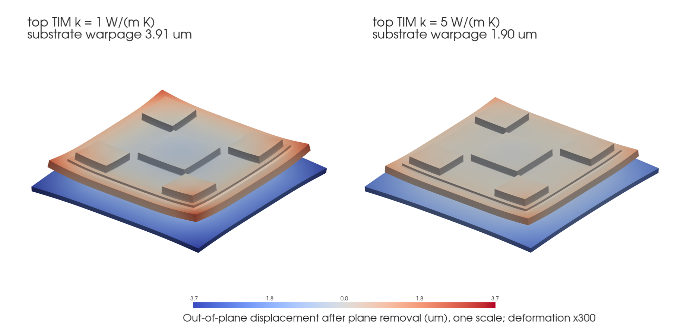

# CoupFE-EDA

CoupFE-EDA connects electronic-design data to finite-element and reliability
models built on [CoupFE](https://github.com/tengzhang48/CoupFE). It includes PDN
and electrothermal handoffs, TSV stress models, solder/package studies,
generated meshes, distributed solver experiments, and provenance-preserving
design adapters.

The repository is intended for reproducible research, teaching, and extension.
Its examples use project-authored synthetic data or caller-supplied files; it is
not an EDA signoff tool.

This is one implementation built on CoupFE, not a prescription that every
project use the same finite-element backend. Similar EDA-to-analysis workflows
can be implemented with other FEM packages, coupling strategies, and data
models. The repository shows the currently implemented possibilities and the
evidence available for them.

The package provides a working foundation for traceable EDA data → analysis →
back-annotation workflows: versioned file contracts, stable object identities,
checked physics handoffs, and extension points. The bundled cases are starting
examples, not a complete interface standard or signoff flow.

CoupFE-EDA uses CoupFE's public operator contract (`residual`, `tangent`,
`commit`, `newton_solve`, and
`complex_step_tangent`) and does not modify CoupFE source. Mesh-aware adapters,
including periodic face/node matching and relation construction, remain in the
EDA package while generic affine constraints and finite-element operators remain
in core.

## Featured example: stacked-memory package

[`examples/stacked_memory_package/`](examples/stacked_memory_package/) takes a
synthetic 90-body package from CAD to a conformal Tet4 mesh, solves steady heat
conduction for two top thermal-interface materials, and carries the
temperature into a thermoelastic warpage solve on the same mesh. The better
interface lowers the peak die temperature by about 16 °C and halves the
substrate warpage; an independent FEniCSx solve of the same declared model
agrees to about 1e-9 on every field.



```bash
python examples/stacked_memory_package/run.py --check   # about 2 min; needs gmsh and gfortran
```

## Explore the repository

| Area | What belongs there | Start here |
|---|---|---|
| Code | Importable operators, solvers, mesh/data adapters, and command-line modules | [`eda_multiphysics/`](eda_multiphysics/) and the [API guide](docs/api.md) |
| Examples | Runnable workflows with a README, fixed inputs, commands, and interpretable output | [`examples/`](examples/) and the [example catalog](EXAMPLES.md) |
| Tests | Automated correctness, failure, provenance, and optional-toolchain checks | [`tests/`](tests/) and the [validation guide](docs/VALIDATION_GUIDE.md) |
| Benchmarks | Fixed reference or performance studies with provenance, configurations, results, and interpretation | [`benchmarks/`](benchmarks/) |
| Website | Static project presentation and the local-workbench frontend | [`web/`](web/) |

## Website and local workbench

The source under [`web/`](web/) supports two deliberately separate uses:

- The default public GitHub Pages route renders checked repository examples,
  retained benchmark records, evidence links, and their stated boundaries. Its
  featured result is a retained CoupFE axisymmetric TSV stress field with raw
  displacement/stress arrays, a solver-derived contour, and a nine-state load
  sweep video.
- The separate `?surface=workbench` route is a read-only real-field explorer on
  GitHub Pages. It validates the retained `field.json`, then derives its
  contour, radial profile, probe values, and load-state views from those arrays.
  It has no mock execution backend or simulated run lifecycle. Neither public
  route runs Python, CoupFE-EDA, OpenROAD, MPI, or a finite-element solver.
- The local workbench can connect to a separately started API service. The
  browser submits domain identifiers to that service; server-owned executor
  registration maps the only Run action to the fixed
  `tsv.axisymmetric-field.v1` workflow. The public Pages deployment does not
  include that API and cannot start local or remote jobs.

The retained field includes nine independent static CoupFE solves at prescribed
temperature changes from `0` to `-400 K`. Their ordering supports visual
comparison; it is not transient cooling or physical time integration. The case
is an axisymmetric plane-strain component verification against the declared
Lamé equation—not a finite-depth 3-D TSV, near-surface device field,
experimental validation, keep-out-zone signoff, or transient simulation.

Run and check the static frontend locally with:

```bash
cd web
npm ci
npm run check
npm run dev
```

To exercise the connected GUI, start its optional loopback-only API from the
repository root:

```bash
./setup.sh
python -m pip install -e '.[workbench]'
coupfe-eda-workbench --repository-root .
```

The setup step installs the pinned CoupFE Core revision used by the allowlisted
`AxisymThermoelastic`/`coupfe.newton_solve` case.

Then start the API-mode frontend in a second terminal:

```bash
cd web
npm ci
npm run dev:api
```

Open the Vite URL with `?surface=workbench` appended. The current API exposes
one server-owned executor for
[`examples/tsv_axisymmetric_field/run.py`](examples/tsv_axisymmetric_field/run.py).
It fixes the 30 µm TSV, `-400 K` load, 300 µm domain, and 2,400-node mesh;
the browser cannot supply a command, parameter, output directory, or timeout.
Records retain `releaseValidation: false`. The API is unauthenticated and
intentionally refuses non-loopback binding, so it is not a network-service
template.

See [`web/README.md`](web/README.md) and
[`web/ARCHITECTURE.md`](web/ARCHITECTURE.md) for the contract and safety
boundary. Do not place credentials or private engineering data in `VITE_*`
variables because Vite exposes those values to the browser.

After GitHub Pages is enabled with **GitHub Actions** as its source, the
deployment workflow publishes the static site at
<https://tengzhang48.github.io/CoupFE-EDA/>. A separate pull-request workflow
type-checks, tests, and builds the frontend before changes are merged.

## Capabilities and current evidence

The following analysis and integration paths are implemented now. The evidence
column identifies the checks included in this repository; the final column
states what still requires broader numerical or experimental validation.

| Implemented capability | Evidence included here | Current limits |
|---|---|---|
| Analytic and component paths for PDN, heat transfer, electrothermal coupling, thermoelasticity, constitutive updates, and electromigration | Named equations, reference meshes, independent implementations, invariants, and broken controls | Applies only to the documented equations, meshes, tolerances, and parameter sets |
| Synthetic PDN → temperature → stress → solder/EM example | Closed-form PDN field, exact power closure, provenance/hash checks, and separately checked downstream components | Bundled inputs are project-authored; the composed downstream result has no fabricated-device oracle or signoff claim |
| Caller OpenDB/PDNSim case and back-annotation contracts | Parser/schema, stable-ID, unit/frame-transform, provenance, and back-annotation tests; the bundled exporter is reviewed but not executed by this suite | No bundled live OpenROAD round trip or qualification of caller-owned designs |
| Solver-side design feedback | `case_thermal` back-annotation contracts and `design_loop_demo` same-current before/after invariant | Synthetic design change only; no live OpenROAD modification, DRC/timing rerun, or design optimization claim |
| Generated compiled electrothermal and thermo-mechanical kernels | Weak-form code generation, compiled element checks, analytic references, and optional toolchain tests | Applies to the implemented weak forms/elements and tested toolchain; not a general code-generation or performance guarantee |
| Generated profiled solder, six-region package, Hex8, and Tet4 paths | Topology, Jacobian/volume, interface, boundary-condition, multimaterial, patch, and generated-mesh checks | No imported production CAD, qualified package deck, or broad mesh-convergence claim |
| Local and periodic TSV-to-device path | Generated Cu/oxide/anisotropic-Si Tet4 mechanics, field recovery and Raman sampling, periodic relation construction, and stable-ID device mapping | Generated/synthetic checks only; source-equivalent boundaries, mesh/domain convergence, distributed periodic consumption, and experimental comparison remain open |
| Plane-strain SnPbAg `solder_joint_cycle` | [Guided six-Quad4 cycle](examples/solder_plane_cycle/) with a retained result; numerical tangent, residual acceptance, and one state commit per increment | Idealized block and loading; reported energy is an example result, not package-life validation |
| Partitioned SAC305 thermo-viscoplastic cycle in `etv_fe` | [Guided quasisteady/transient comparison](examples/etv_partitioned_cycle/) with a fast 2 × 2 smoke oracle and separately retained 20 × 20 public result; spatial Anand increments meet Core's residual rule | The public value is a 20-element, 5 µm-deep top-row mean on one selected mesh; not mesh/load-step convergence, a monolithic phi-T-u element, device validation, crack prediction, or life prediction |
| Multi-element `solder_joint_bvp_3d` and design-linked screening | [Guided 18-Hex8 cycle](examples/solder_3d_cycle/) and [design-linked screening](examples/design_linked_solder_screening/) with dissipation fields and retained object provenance | Idealized regular block; no crack-location, mesh/load-step-converged field, or predictive-life claim |
| `etv_distributed_fs` serial-versus-rank path | Output agreement at size 24 with two and four ranks; [reviewed 526,338-DOF local sweep](benchmarks/solver_scaling/current_526338dof_20260801/) at 1/2/4/8 ranks with three repeats (26.0718 s to 3.93986 s median, 6.62×) | The timing describes one nonexclusive KVM guest, revision, problem, solver region, and rank set; it is not a general scalability guarantee |

See [EXAMPLES.md](EXAMPLES.md) and
[examples/REFERENCES.md](examples/REFERENCES.md) for entry-point evidence and
provenance.

## Quick start

```bash
conda env create -f environment.yml
conda activate coupfe-eda
./setup.sh
python -m eda_multiphysics.run
python -m pytest -q
```

`setup.sh` clones or refreshes public CoupFE `main` in `.deps/CoupFE`, checks out
and verifies commit `e2f42ed5772850a0a23a2ce434f430c287eae5c8`, rejects a dirty
dependency checkout, installs both packages in editable mode, and checks the
import location. The source URL, branch, checkout directory, and commit can be
set with `COUPFE_URL`, `COUPFE_BRANCH`, `COUPFE_DIR`, and `COUPFE_REF`; changing
the commit requires a new verification run.

The default environment includes the scientific, mesh, MPI, and open-EDA Python
dependencies. OpenROAD is installed separately or through the optional
container.

For a result-oriented starting point, run one of the documented workflows:

```bash
python examples/solder_plane_cycle/run.py --check
python examples/etv_partitioned_cycle/run.py --check
python examples/solder_3d_cycle/run.py --check
python examples/design_linked_solder_screening/run.py --check
```

Each directory explains its inputs, output fields, references, and current
limitations. See [EXAMPLES.md](EXAMPLES.md) for the complete catalog.
The website's selected 20 × 20 ETV evidence is the separate, slower
`python examples/etv_partitioned_cycle/run.py --mesh-size 20 --check` case; the
default 2 × 2 command above remains the fast regression smoke check.

### Optional container

Docker is a convenience, not a source-release acceptance gate:

```bash
./build.sh
docker run --rm -it coupfe-eda
docker run --rm coupfe-eda python -m eda_multiphysics.run
```

The image recipe pins the CoupFE commit and OpenROAD artifact digest. The
conda-forge solve is rolling; record `conda list --explicit` when an exact
environment record is needed. See [CONTAINER.md](CONTAINER.md).

## What is included

### EDA and PDN handoffs

- `eda_multiphysics/openroad/export_case.tcl` maps OpenDB objects into the
  versioned case representation.
- PDN networks can be read from caller-supplied PDNSim `write_pg_spice` output.
- `case_thermal.py`, `electrothermal_chip.py`, and `chip_vtu.py` preserve source
  identifiers and back-annotation fields across the handoff.
- `reliability_pipeline.py` runs a deterministic synthetic IR → temperature →
  stress → screening chain. Its graph voltage is checked against the fixture's
  closed-form field, while later links rely on separate component checks. The
  composed result is a demonstration.
- `design_loop_demo.py` applies a solver-side synthetic strap change and checks
  the before/after result at the same total current. It demonstrates a feedback
  pattern without modifying a live OpenROAD database.

No ORFS GCD deck, PDK, generated design database, or raw OpenROAD output is
bundled. The project-authored fixture and caller-data boundary are documented in
[THIRD_PARTY.md](THIRD_PARTY.md).

### Generated geometry and mechanics

- `tsv_3d.py` exercises Hex8 electrothermal elements on generated cylinder,
  annulus, and layer-stack meshes with named idealized references.
- `tet_3d.py` exercises CoupFE's native Tet4 on generated box and cylinder
  meshes. With Core `e2f42ed`, the checked scope includes the tested generated
  shapes and conformal package case; imported STEP/BREP geometry and broader
  mesh convergence remain research work.
- `thermomech_3d.py` and `thermomech_tsv.py` cover generated thermo-mechanical
  cases and compare selected observables with free-expansion,
  constrained-block, or composite-cylinder references.
- `mesh3d.py` provides generated TSV, layer-stack, profiled-joint, and conformal
  package geometry helpers. It is not a package-CAD interface.
- `etv_kernel.py` and `thermomech_kernel.py` use CoupFE weak forms to generate
  and compile the coupled element kernels exercised by the optional toolchain
  and distributed paths.

### Solder and electro-thermo-viscoplastic studies

- `anand.py` and `anand_3d.py` provide material-point, return-map, transient,
  affine-patch, fully prescribed `prescribed_hex8_cycle`, and fail-closed
  multi-element block examples. The measured 4719-cycle PBGA value is an
  in-sample calibration anchor, not independent validation.
- `solder_joint.py` exposes the plane-strain return-map, elastic patch, and a
  fail-closed stateful multi-element cycle example.
- `etv_solder.py` retains the simplified material-point electro-thermal-
  viscoplastic study.
- `etv_fe.py` contains the steady electrothermal Quad4 implementation and its
  analytic/staggered comparisons, plus a partitioned lumped-temperature and
  spatial-mechanics cycle example.
- `reliability_3d.py` demonstrates global parametric joint/package geometry,
  caller-supplied joint locations and provenance, and a calibration-specific
  global-local workflow. Caller joint dimensions do not currently set the FE
  mesh dimensions. `critical_joint_bvp_screening` connects one maximum-DNP
  design object to the idealized stateful block while retaining the full tie
  set and deterministic row-order selection rule.

The corresponding result-bearing workflows are
[`solder_plane_cycle`](examples/solder_plane_cycle/),
[`etv_partitioned_cycle`](examples/etv_partitioned_cycle/),
[`solder_3d_cycle`](examples/solder_3d_cycle/), and
[`design_linked_solder_screening`](examples/design_linked_solder_screening/).
Their JSON oracles are numerical regression records for the stated inputs, not
experimental validation data.

### TSV-to-device screening

`tsv_local_3d.py` implements the generated local Cu/oxide/anisotropic-Si Tet4
mechanics and recovery path. `periodic.py` owns mesh-aware opposite-face
matching and emits generic affine relations consumed by Core. These paths keep
mesh and EDA semantics in the application package; their current checks do not
establish source-equivalent boundary conditions or experimental agreement.

`examples/tsv_00_device_screening/` maps a classical Lamé far-field stress proxy
onto synthetic, stable device IDs using cited piezoresistance equations. It emits
CSV, JSON, and SVG records. The result demonstrates identity-preserving mapping;
it does not establish near-surface anisotropic stress, transistor delay, Cu
protrusion, measured Raman agreement, or a signoff keep-out zone.

### Distributed execution

`etv_distributed_fs.py` includes the retained serial-versus-rank output check at
size 24 with two and four ranks. `scaling_bench.py` is the measurement harness;
[`benchmarks/solver_scaling/`](benchmarks/solver_scaling/) holds its study
definition, a reviewed current-revision 526,338-DOF local rank sweep, complete
retained streams, and its interpretation boundary. Historical development
timings are kept separately from measurements reproduced from a named public
revision. The other PETSc/MPI modules remain research drivers until they have
equivalent records.

The research `etv_distributed.py` driver exposes
`--element-evaluation {joint,split}`. `joint` is the default; `split` uses the
native residual-only element entry for Core's convergence and line-search
callbacks while Jacobian callbacks retain joint R/K evaluation. This option
does not apply to `etv_distributed_fs`, whose current Newton loop requests one
joint R/K assembly per step. The retained FieldSplit timing record predates the
option and is not evidence for a split-path speedup.

## Verification and references

Verification entry points are separated by dependency needs:

```bash
python -m eda_multiphysics.run       # self-contained component/reference gates
python -m pytest -q                  # default regression tier
python -m pytest -q -m toolchain     # compiled, mesh, and PETSc/MPI checks
```

Test totals are intentionally omitted here because they are regenerated during
dated verification. A passing component check supports its named boundary;
it does not qualify every composed workflow or caller dataset.

The pytest toolchain tier does not run an OpenROAD/OpenDB or PDNSim round trip.
Those adapters require a caller-provided tool installation and case-specific
data.

Useful records:

- [Validation guide](docs/VALIDATION_GUIDE.md) — equations, references,
  tolerances, and claim boundaries.
- [Capabilities](docs/capabilities.md) — current implementation inventory.
- [Geometry guide](docs/GEOMETRY.md) — mesh and package geometry scope.
- [Periodic MPC status](docs/PERIODIC_MPC_STATUS.md) — ownership and dependency
  boundary.
- [API migrations](docs/API_MIGRATIONS.md) — corrected and renamed pre-release
  interfaces.
- [Project origins](docs/history/PROJECT_ORIGINS.md) — initial purpose and the
  dated technical-history trail.
- [Release evidence runbook](docs/RELEASE_EVIDENCE.md) — how to retain logs,
  environments, and artifact checksums.
- [Third-party record](THIRD_PARTY.md) — software, data, and attribution.

The main open milestone is real-device validation: a lawfully shareable layout
and package geometry, traceable materials and loads, documented boundary
conditions, retained solver evidence, and comparison with measured electrical,
thermal, or stress observables.

## Repository map

```text
environment.yml            conda environment
Dockerfile / build.sh      optional container recipe
setup.sh                   pinned CoupFE checkout and editable install
EXAMPLES.md                runnable example catalog
examples/REFERENCES.md     entry-point provenance and status
benchmarks/                reference comparisons and retained performance studies
web/                       static website and local-workbench frontend source
skills/SKILL.md            contributor workflow for adding a checked example
docs/                      theory, API, geometry, validation, and evidence guidance
eda_multiphysics/          package source and synthetic fixture
tests/                     regression and toolchain tests
```

The package modules are grouped for navigation in
[docs/COMPONENTS.md](docs/COMPONENTS.md); the grouping is organizational rather
than a maturity score.

## Acknowledgments and attribution

CoupFE-EDA uses the operator contract provided by
[CoupFE](https://github.com/tengzhang48/CoupFE) and builds on interfaces provided
by the [OpenROAD](https://github.com/The-OpenROAD-Project/OpenROAD) community,
including
[OpenDB](https://openroad.readthedocs.io/en/latest/main/src/odb/README.html) and
[PDNSim](https://openroad.readthedocs.io/en/latest/main/src/psm/README.html).
Analytic, constitutive, and reliability models are credited at the point of use,
in the [validation guide](docs/VALIDATION_GUIDE.md), and in the
[entry-point reference map](examples/REFERENCES.md). Third-party names identify
their contributions and do not imply endorsement.

AI agents assisted with implementation, documentation, and test development.
Checked-in source, executable tests, cited references, retained benchmark
records, and engineering review—not agent output alone—define the public
evidence.

The external
[ORFS GCD sanity design](https://github.com/The-OpenROAD-Project/OpenROAD-flow-scripts/tree/c9c22caf9bf9cfe46c5a4236c6ec7e7ae9863cc3/flow/designs/src/gcd)
helped illustrate an applicable flow. No GCD source, platform data, generated
design file, or tool output is distributed here.

## License and third-party notices

Code, tests, schemas, and configuration are Apache-2.0 licensed under
[LICENSE](LICENSE). Project-authored prose and figures are CC-BY-4.0 under the
[documentation license](docs/LICENSE.md). OpenROAD's container notice and the
boundary for caller-supplied designs are documented in [NOTICE](NOTICE),
[THIRD_PARTY.md](THIRD_PARTY.md), and [LICENSES/](LICENSES/).
