# Validation Guide for `coupfe-eda`

This guide explains every regression test in the repository, what physics it exercises,
what evidence or assertion it checks, and how to run it. It is meant for new contributors,
reviewers, and anyone who wants to understand why a test exists and what a failure means.

> **Scope:** this repository is a first reproducible CoupFE-based implementation
> example, not a field standard or a qualified real-device workflow. Other projects
> may use different FEM solvers, coupling architectures, and data models. The primary
> next milestone is comparison with measured electrical, thermal, and stress
> observables on a lawfully shareable real device with traceable inputs and retained
> raw evidence.

There are two test tiers, with fast tests split between physics gates and integration behavior:

- **Fast physics gates** — `pytest eda_multiphysics` (~40 s). Pure Python / numpy / scipy. No
  gmsh, PETSc, or Fortran compiler needed.
- **Fast integration/CLI regressions** — `pytest tests/test_integration_regressions.py` (~7 s).
- **Toolchain tier** — `pytest -m toolchain` (19 tests, ~5 min). Needs `gmsh`, `petsc4py`,
  `mpi4py`, and `gfortran`.

Evidence in the suite includes:

1. **Analytical closed-form solutions** (patch tests, Ohm's law, Joule self-heating,
   Lamé cylinder, Timoshenko bimetal, etc.).
2. **Published benchmarks / standards** (Choi TSV Lamé stress, Motalab SAC305 Anand,
   Black/Blech EM, thermal-runaway critical power).
3. **Independent code paths** (PDN graph vs `scipy`, monolithic vs staggered solver).
4. **Broken controls / sanity checks** (structural zeros that must fail, e.g. `Q=0`
   should give no Joule heating).
5. **Interface and structural checks** (schema, geometry, conservation, finite-value,
   and handoff invariants).

A composed workflow gate does not automatically give every stage a direct oracle.
The tables and sections below distinguish direct comparisons from structural
handoff checks and from separately tested component models.

The guide groups tests by physics, shows the relevant figure, and gives the exact
assertion and a literature reference where applicable.

---

## Quick reference table

| Test file | Test / gate | Physics | Evidence type | Reference / assertion |
|---|---|---|---|---|
| `gates.py` | `gate_thermal_patch` | 1-D steady thermal conduction | analytic | `T = x/L` |
| `gates.py` | `gate_ohm` | electrical conduction | analytic | `I = σ V₀ W / L` |
| `gates.py` | `gate_joule_oneway` | 1-D Joule self-heating | analytic | `ΔT_peak = σ V₀² / 8k` |
| `gates.py` | `gate_joule_broken_control` | structural zero | broken control | `Q=0` must fail |
| `gates.py` | `gate_tsv_lame` | TSV radial stress | **published** | Choi et al., *Materials* 2021 14(18):5226 |
| `gates.py` | `gate_anand_saturation` | viscoplastic integrator | self-consistency | integrator vs closed-form `σ_sat` |
| `gates.py` | `gate_anand_broken_control` | wrong activation energy | broken control | `Q/R × 1.1` misses oracle |
| `gates.py` | `gate_anand_sac305_saturation` | SAC305 integrator | self-consistency | closed-form saturation |
| `gates.py` | `gate_anand_sac305_benchmark` | SAC305 saturation | **published** | Motalab et al., ITherm 2012 / Auburn PhD 2013 |
| `gates.py` | `gate_anand_sac305_broken_control` | wrong prefactor | broken control | `A × 100` misses figure |
| `gates.py` | `gate_solder_return_map` | J2 radial return | analytic | closed-form saturation in pure shear |
| `gates.py` | `gate_solder_patch` | elastic FE patch | patch test | affine field exact |
| `gates.py` | `gate_pdn_vs_scipy` | PDN resistor graph | independent solver | identical network solved with `scipy` |
| `gates.py` | `gate_black_acceleration` | EM temp acceleration | **standard** | Black 1969 / JEDEC JEP119, AF ~13.1× |
| `gates.py` | `gate_blech_product` | EM immortality | **published range** | Blech 1976, `(jL)_crit` 1000–6000 A/cm |
| `gates.py` | `gate_em_broken_control` | structural zero | broken control | short high-J segment must be immortal |
| `gates.py` | `gate_bimetal` | thermoelastic bending | **published** | Timoshenko 1925 bimetal curvature |
| `gates.py` | `gate_bimetal_broken_control` | equal CTE | broken control | zero curvature |
| `gates.py` | `gate_thermal_gradient_cylinder` | thermal stress | **published** | Timoshenko–Goodier *Theory of Elasticity* Art. 152 |
| `gates.py` | `gate_capacitance` | capacitance extraction | analytic | `C = ε A / d` |
| `gates.py` | `gate_capacitance_scaling` | capacitance scaling | analytic | `C ∝ 1/d` |
| `gates.py` | `gate_runaway_critical` | thermal runaway saddle-node | **published** | Bhat et al., ACM TECS 2017 |
| `gates.py` | `gate_runaway_balance` | power balance | analytic | fixed-point residual |
| `gates.py` | `gate_transient` | transient diffusion | analytic | first eigenmode `λ = (π/L)² α` |
| `gates.py` | `gate_transient_broken_control` | zero conductivity | broken control | no decay |
| `gates.py` | `gate_creep_rate` | secondary creep | analytic | inverse-saturation rate |
| `gates.py` | `gate_creep_broken_control` | zero stress | broken control | zero creep |
| `gates.py` | `gate_lame_cylinder` | pressurized thick cylinder | analytic | Lamé hoop stress |
| `gates.py` | `gate_capstone_pipeline` | full integration → reliability chain | direct PDN oracle + structural handoff checks | closed-form nodal IR; finite/physical stage outputs and Blech-range check; component evidence is separate |
| `gates.py` | `gate_capstone_broken_control` | zero power | broken control | no self-heating / stress |
| `gates.py` | `gate_etv_selfheating` | 2-D coupled ET self-heating | analytic | `σ V₀² / 8k` |
| `gates.py` | `gate_etv_crowding` | current crowding | **published** | Dandu et al., *Microelectron. Reliab.* 50(4):547, 2010 |
| `gates.py` | `gate_etv_broken_control` | uniform current | broken control | no crowding |
| `gates.py` | `gate_etv_staggered` | SAC305 cycling | physical sanity | shakedown `dW` stabilizes |
| `gates.py` | `gate_etv_staggered_broken_control` | no temperature swing | broken control | zero inelastic `dW` |
| `gates.py` | `gate_etv_monolithic_consistency` | solver consistency | self-consistency | monolithic == staggered (no internal heating) |
| `gates.py` | `gate_etv_coupling_quasistatic` | coupling strength | project finding | `τ/period` quantifies when coupling matters |
| `gates.py` | `gate_etv_fe_selfheating` | monolithic FE element | analytic | `σ V₀² / 8k` |
| `gates.py` | `gate_etv_fe_consistency` | solver consistency | self-consistency | monolithic FE == staggered Picard |
| `gates.py` | `gate_etv_fe_broken_control` | no voltage | broken control | no Joule heating |
| `gates.py` | `gate_etv_fe_stageb_consistency` | solver consistency | self-consistency | Stage-B monolithic reduces to staggered |
| `test_toolchain.py` | `test_etv_3d_self_heating` | 3-D Hex8 coupled ET | analytic | `σ V₀² / 8k = 1.0` |
| `test_toolchain.py` | `test_tsv_3d_solid_cylinder` | gmsh cylinder Joule heating | analytic | `σ₀ V² R² / 4kL² = 2.0` |
| `test_toolchain.py` | `test_tsv_3d_annular_via` | gmsh annular via | analytic | composite-cylinder peak |
| `test_toolchain.py` | `test_tsv_3d_layer_stack` | gmsh layer stack | analytic | 1-D series-resistance profile |
| `test_toolchain.py` | `test_thermomech_3d_free_expansion` | 3-D thermoelastic free expansion | analytic | `u = (λ−1) X` |
| `test_toolchain.py` | `test_thermomech_3d_constrained_block` | 3-D constrained block | broken control | `u ≈ 0` |
| `test_toolchain.py` | `test_thermomech_tsv_fieldsplit_vs_direct` | Cu/Si TSV mismatch stress | analytic | plane-strain composite-cylinder displacement |
| `test_toolchain.py` | `test_etv_distributed_fs_serial_matches_mpi` | distributed PETSc solve | self-consistency | serial == 2-rank to 1e-6 |
| `test_toolchain.py` | `test_solder_bump_profile_geometry` | barrel/hourglass Gmsh geometry | structural | connected Hex8, exact caps/radius, positive Jacobian |
| `test_toolchain.py` | `test_solder_package_conformal_regions` | six-region package geometry | structural + exact | connected Tet4, shared interfaces, exact OCC volumes |
| `test_toolchain.py` | `test_reliability_3d_solder_joint` | 3-D solder joint shear | analytic | DNP shear `γ = Δα ΔT L_D / h` |
| `test_toolchain.py` | `test_reliability_3d_profile_changes_strain_field` | joint-shape sensitivity | dependency | profile materially changes upper-tail strain; cap BCs preserved |
| `test_toolchain.py` | `test_solder_package_multimaterial_solve` | package material regions | dependency | exact pad BCs, finite solder strain, KSP bound |
| `test_toolchain.py` | `test_reliability_3d_design_map` | joint map → fatigue map | schema + synthetic proxy | 9 stable IDs, labeled first-party proxy, 60×60 µm, DNP ~42.426 µm |
| `test_toolchain.py` | `test_reliability_design_map_with_package_regions` | joint map → package fatigue | composed dependency | package regions actively feed finite per-joint life map |

---

## How to run the tests

```bash
# Fast physics gates only (53 tests; numpy/scipy, ~40 s)
pytest eda_multiphysics

# All default tests (53 physics + 16 integration/CLI + 9 TSV-device
# + 4 local-TSV foundation + 12 EDA periodic-adapter tests)
pytest

# Toolchain tier only (gmsh + petsc4py + gfortran, ~3 min)
pytest -m toolchain

# Everything, overriding the repository's default toolchain exclusion
pytest -o addopts=''
```

### Periodic-MPC environment

The periodic TSV API requires the mesh-agnostic affine-constraint API in
qualified CoupFE release root
`933e497301ee3ddb23391b787726674f70b480c5`. `PeriodicBox`, node matching, and
periodic relation construction are EDA-owned and are not Core dependencies.
`setup.sh` and `build.sh` pin that exact root on public `main`; they fail if the
commit is not reachable from that branch. A stale editable
CoupFE checkout can let fast tests exercise a different source tree, so release
evidence must also record the imported Core revision and location.

The direct MPI reference needs a PETSc build with `superlu_dist`; a generic pip PETSc build may
omit it. Activate the supported conda environment and verify the factor package before running
the direct MPI smoke:

```bash
conda activate coupfe-eda
python -c \
  "from petsc4py import PETSc; assert PETSc.Sys.hasExternalPackage('superlu_dist')"
python -m pytest -q -m toolchain \
  tests/test_toolchain.py::test_tsv_device_submodel_geometry_regions_and_interfaces
```

Run `./setup.sh` first so the exact core pin is installed and import-verified. Do not treat a plain
`pytest` run as periodic-TSV evidence.

To regenerate the figures in this guide:

```bash
python docs/validation_guide/generate_figures.py
```

---

## 1. Scalar electrothermal gates

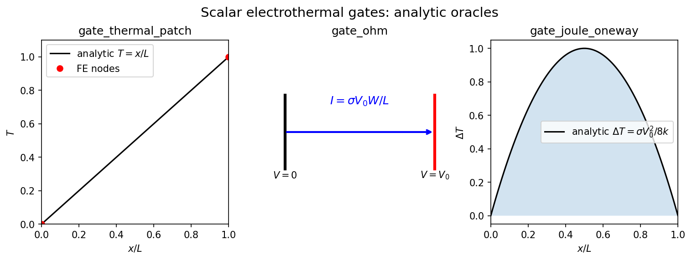

These gates exercise the simplest CoupFE operator: steady scalar diffusion with one
field (temperature or voltage). They prove the FE assembly, tangent, and Dirichlet BCs
before any coupling is introduced.

### `gate_thermal_patch`
- **Physics:** 1-D steady thermal conduction, `T=0` at `x=0`, `T=1` at `x=L`.
- **Oracle:** `T(x) = x/L` exactly (linear patch test).
- **What failure means:** the diffusion operator or BC enforcement is wrong.

### `gate_ohm`
- **Physics:** 2-D rectangular conductor, voltage `V₀` applied across length `L`.
- **Oracle:** Ohm's law, `I = σ V₀ W / L`.
- **What failure means:** electrical conduction residual or flux post-processing is wrong.

### `gate_joule_oneway`
- **Physics:** 1-D electrical resistor with `σ` constant, ends held at `V=0` and `V=V₀`.
  Joule heat `Q = σ |∇V|²` drives the thermal field with ends insulated.
- **Oracle:** parabolic temperature profile; peak `ΔT = σ V₀² / 8k`.
- **What failure means:** the one-way electrical→thermal coupling is broken.

### `gate_joule_broken_control`
- **Physics:** same setup but with the heat source artificially set to zero.
- **Oracle:** the solver must **not** produce a temperature rise.
- **What failure means:** a non-physical heat source is being added.

---

## 2. TSV thermoelastic stress

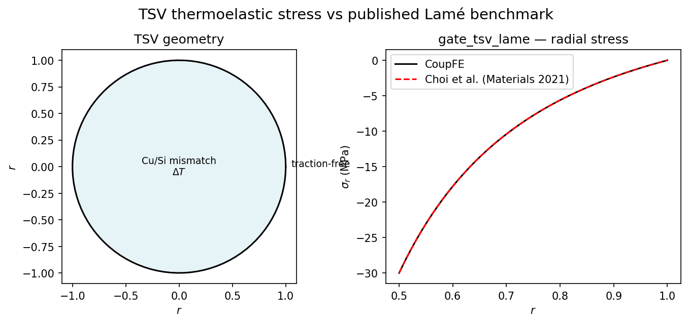

### `gate_tsv_lame`
- **Physics:** axisymmetric thermoelastic cylinder (Cu via in Si matrix) under a
  temperature change.
- **Oracle:** Lamé closed-form radial stress.
- **Reference:** **Choi et al.**, *Materials* 2021, 14(18):5226 (PMC8472814). The paper
  reports a 3-D FEA-vs-analytic comparison; this gate reproduces the same Lamé oracle
  and matches it to **0.06%**.
- **What failure means:** the thermoelastic operator or axisymmetric formulation is wrong.

---

## 3. Anand / solder viscoplasticity

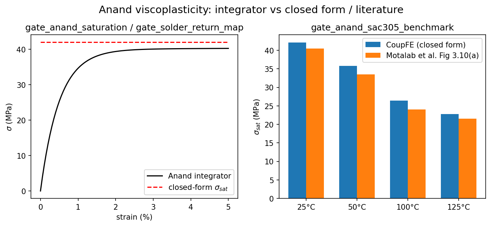

These gates validate the material-point viscoplastic integrator and its FE implementation.

### `gate_anand_saturation`
- **Physics:** uniaxial monotonic load with the Anand model.
- **Oracle:** the numerical integrator must reach the model's own closed-form saturation
  stress `σ_sat = (ṡ/ξ) sinh⁻¹(ż^m)`.
- **What failure means:** the return-mapping integrator is wrong.

### `gate_anand_sac305_saturation`
- **Physics:** same check for the lead-free SAC305 parameter set.
- **Oracle:** closed-form saturation using SAC305 constants.
- **Reference:** Motalab et al. constants (see below).

### `gate_anand_sac305_benchmark`
- **Physics:** SAC305 saturation stress at multiple temperatures and strain rates.
- **Oracle:** published Fig 3.10(a) from **Motalab, Cai, Suhling, Lall**, ITherm 2012 /
  Auburn PhD dissertation 2013.
- **What failure means:** the SAC305 parameter set or integrator does not reproduce the
  published benchmark.

### `gate_solder_return_map`
- **Physics:** J2 radial return in pure shear.
- **Oracle:** saturation stress from the closed form.
- **What failure means:** the multiaxial return map is wrong.

### `gate_solder_patch`
- **Physics:** elastic FE patch with affine displacement field.
- **Oracle:** strain must be constant and exact.
- **What failure means:** the FE assembly or shape-function derivatives are wrong.

---

## 4. PDN electrical and electromigration

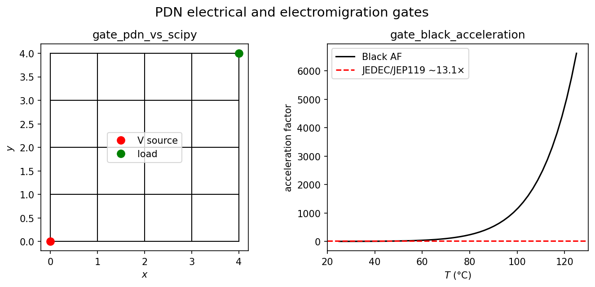

### `gate_pdn_vs_scipy`
- **Physics:** resistor graph in the same subset accepted from PDNSim `write_pg_spice`;
  the gate constructs its graph directly.
- **Oracle:** the same network assembled and solved independently with `scipy.sparse`.
- **What failure means:** the PDN-graph conduction operator is wrong.

### `gate_black_acceleration`
- **Physics:** electromigration mean-time-to-failure temperature acceleration.
- **Oracle:** Black's equation acceleration factor ~13.1× for a typical JEDEC temperature
  swing.
- **Reference:** **Black 1969**; JEDEC JEP119.
- **What failure means:** the EM acceleration model is wrong.

### `gate_blech_product`
- **Physics:** Blech immortality product `(jL)_crit`.
- **Oracle:** published range 1000–6000 A/cm.
- **Reference:** **Blech 1976**.
- **What failure means:** the Blech filter logic is wrong.

### `gate_em_broken_control`
- **Physics:** a very short, high-current segment.
- **Oracle:** it must be flagged Blech-immortal.
- **What failure means:** the immortality criterion is inverted.

---

## 5. Thermomechanics

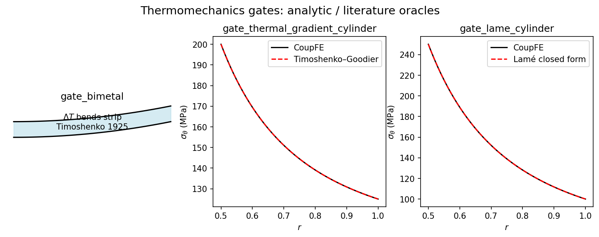

### `gate_bimetal`
- **Physics:** bimetallic strip heated uniformly; one layer expands more than the other.
- **Oracle:** curvature from **Timoshenko 1925**, "Analysis of Bi-Metal Thermostats."
- **What failure means:** the thermoelastic bending operator is wrong.

### `gate_bimetal_broken_control`
- **Physics:** both layers have the same CTE.
- **Oracle:** zero curvature.
- **What failure means:** thermal strain is applied incorrectly.

### `gate_thermal_gradient_cylinder`
- **Physics:** hollow cylinder with a radial temperature gradient.
- **Oracle:** hoop stress from **Timoshenko & Goodier**, *Theory of Elasticity*, Art. 152.
- **What failure means:** non-uniform temperature → stress coupling is wrong.

### `gate_lame_cylinder`
- **Physics:** thick-walled cylinder under internal pressure.
- **Oracle:** Lamé closed-form hoop stress.
- **What failure means:** the elasticity operator is wrong.

---

## 6. Capacitance, runaway, transient, creep

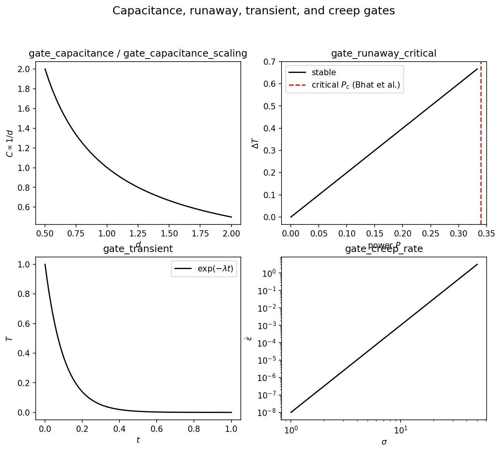

### `gate_capacitance` / `gate_capacitance_scaling`
- **Physics:** parallel-plate capacitor via electrostatic charge integration.
- **Oracle:** `C = ε A / d` and `C ∝ 1/d`.
- **What failure means:** the capacitance extraction operator is wrong.

### `gate_runaway_critical`
- **Physics:** thermal runaway in a device with temperature-dependent leakage.
- **Oracle:** saddle-node critical power from **Bhat et al.**, ACM TECS 2017.
- **What failure means:** the nonlinear thermal feedback is wrong.

### `gate_runaway_balance`
- **Physics:** same device at a fixed point.
- **Oracle:** generated power equals removed power.
- **What failure means:** the residual or source term is wrong.

### `gate_transient`
- **Physics:** 1-D transient diffusion.
- **Oracle:** first eigenmode decay `λ = (π/L)² α`.
- **What failure means:** the time integrator is wrong.

### `gate_creep_rate`
- **Physics:** secondary (steady-state) creep.
- **Oracle:** inverse-saturation creep rate.
- **What failure means:** the creep law integration is wrong.

---

## 7. ETV coupled solver gates

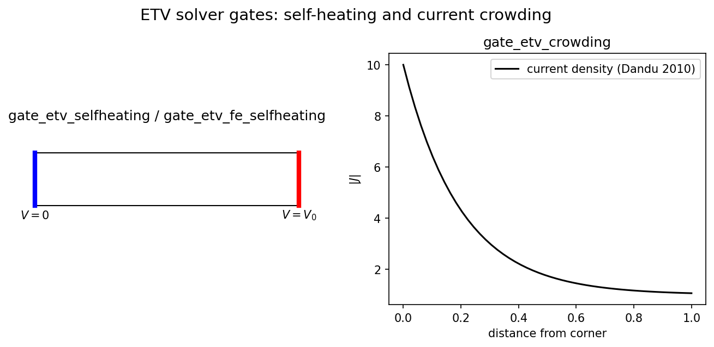

These gates exercise the 2-D coupled electro-thermal solver (`electrothermal.py` and
`etv_fe.py`).

### `gate_etv_selfheating` / `gate_etv_fe_selfheating`
- **Physics:** 2-D strip with voltage applied across the length; lateral sides insulated.
- **Oracle:** peak `ΔT = σ V₀² / 8k`.
- **What failure means:** the staggered or monolithic ET solver does not reproduce the
  1-D limit.

### `gate_etv_crowding`
- **Physics:** L-shaped or corner conductor; current crowds at the inner corner.
- **Oracle:** current-density amplification ~10× at the corner.
- **Reference:** **Dandu et al.**, *Microelectron. Reliab.* 50(4):547, 2010.
- **What failure means:** the electrical solve does not capture geometric current crowding.

### `gate_etv_monolithic_consistency` / `gate_etv_fe_consistency` / `gate_etv_fe_stageb_consistency`
- **Physics:** same problem solved with the staggered Picard solver and the monolithic
  Newton solver.
- **Oracle:** the two solvers agree when internal heating is negligible.
- **What failure means:** the monolithic coupled tangent is wrong.

---

## 8. Capstone pipeline

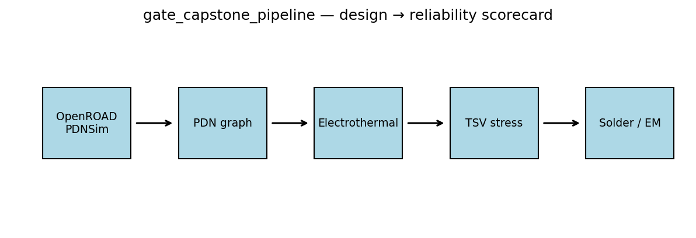

### `gate_capstone_pipeline`
- **Physics:** full integration chain on the project-authored synthetic PDN fixture.
- **Stages:** placement/PDN case → PDN graph → coupled electrothermal → TSV stress →
  solder fatigue + electromigration screen.
- **Direct composed-case oracle:** synthetic PDN IR versus its closed-form
  symmetric-grid solution.
- **Other assertions:** exact PDN load-plus-loss power closure, finite/physical
  downstream values, active power-dependent handoffs, and the expected Blech-range
  result. Thermal, Lamé, Anand/Syed, and
  Black/Blech implementations have separate component gates elsewhere in this guide;
  those gates are not a direct experimental oracle for the composed output.
- **What failure means:** the PDN reference, a handoff contract, or a structural
  sanity condition in the integration chain broke.

### `gate_capstone_broken_control`
- **Physics:** same chain with zero chip power.
- **Structural assertions:** no self-heating, no thermal stress, no fatigue driver.
- **What failure means:** a source term is not being gated by power.

---

## 9. Toolchain tier: 3-D coupled electro-thermal

### `test_etv_3d_self_heating`

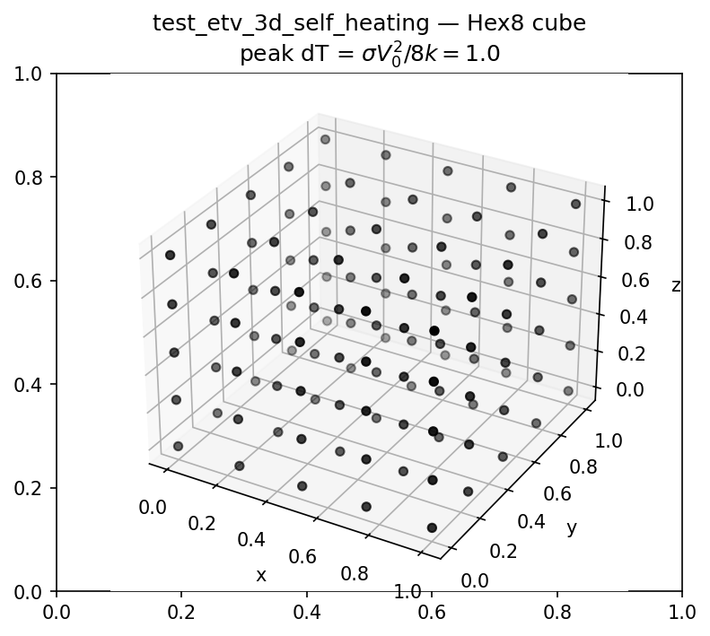

- **Public API:** `eda_multiphysics.etv_3d.solve`
- **Call:** `solve(16, (3.0, 0.0, 1.5))`
- **Physics:** 3-D Hex8 coupled electro-thermal cube. `α=0` turns off thermal feedback
  so the 1-D self-heating limit applies.
- **Oracle:** `peak ΔT = σ V₀² / 8k = 1.0`.
- **Assertion:** relative error `< 2e-3`.
- **What failure means:** the 3-D Hex8 kernel, Newton loop, or FieldSplit solve is wrong.

### `test_tsv_3d_solid_cylinder`

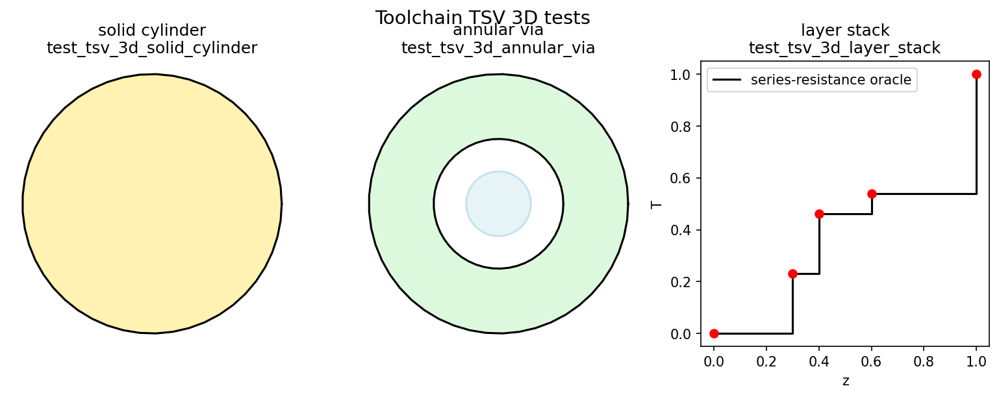

- **Public API:** `eda_multiphysics.tsv_3d.solve_via`
- **Call:** `solve_via(0.18)`
- **Physics:** gmsh-meshed solid copper cylinder, voltage applied end-to-end, lateral wall
  held at `T=0`.
- **Oracle:** `peak ΔT = σ₀ V² R² / 4kL² = 2.0`.
- **Assertion:** relative error `< 6e-3`.

### `test_tsv_3d_annular_via`
- **Public API:** `eda_multiphysics.tsv_3d.solve_annular_via`
- **Call:** `solve_annular_via(0.18)`
- **Physics:** concentric Cu core / Si annulus.
- **Oracle:** composite-cylinder peak temperature.
- **Assertion:** relative error `< 6e-3`.

### `test_tsv_3d_layer_stack`
- **Public API:** `eda_multiphysics.tsv_3d.solve_layer_stack`
- **Call:** `solve_layer_stack([(0.3,1.5),(0.1,0.5),(0.2,3.0),(0.4,1.0)], h=0.18)`
- **Physics:** die / underfill / solder / substrate stack, pure conduction.
- **Oracle:** 1-D series-resistance profile `T(z) = T_top · R(z)/R_tot`.
- **Assertion:** `max|err| < 1e-12` (nodally exact).

---

## 10. Toolchain tier: 3-D thermo-mechanics

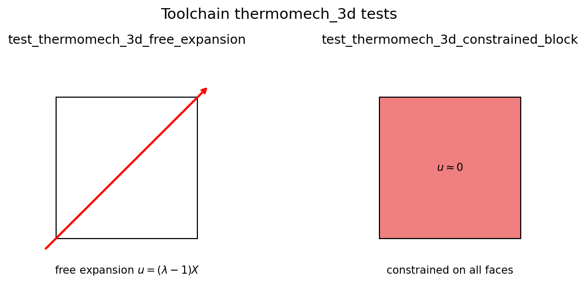

### `test_thermomech_3d_free_expansion`
- **Public API:** `eda_multiphysics.thermomech_3d.solve_thermomech`
- **Call:** `solve_thermomech(4, dT=10)`
- **Physics:** 3-D block with symmetry rollers on three faces; uniform temperature rise.
- **Oracle:** stress-free isotropic stretch `u(X) = (λ−1) X`, where `λ` solves
  `G(λ²−1) + 3K ln λ = K α ΔT`.
- **Assertion:** `max|u − u_ref| / max|u| < 1e-9`.

### `test_thermomech_3d_constrained_block`
- **Public API:** `eda_multiphysics.thermomech_3d.solve_thermomech`
- **Call:** `solve_thermomech(4, dT=10, constrained=True)`
- **Physics:** same block but all six faces fixed.
- **Oracle:** `u ≈ 0`.
- **Assertion:** `max|u| < 1e-9`.
- **Why it matters:** proves the element distinguishes free expansion from fully
  constrained response.

---

## 11. Toolchain tier: TSV thermal-mismatch stress

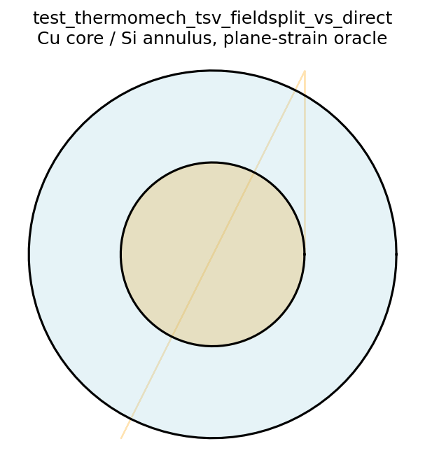

### `test_thermomech_tsv_fieldsplit_vs_direct`
- **Public API:** `eda_multiphysics.thermomech_tsv.solve_tsv_thermal_stress`
- **Call:** `solve_tsv_thermal_stress(0.18, solver="fieldsplit")` and `"direct"`
- **Physics:** gmsh Cu-core / Si-annulus cylinder, uniform `ΔT`, plane strain.
- **Oracle:** plane-strain composite-cylinder radial displacement `u_r(r)`.
- **Assertions:**
  - `profile_error < 6e-3`
  - direct and fieldsplit solutions agree to `< 1e-6`
  - FieldSplit KSP iterations `< 40` (guards the expected configured-solver behavior; it does not
    by itself prove that the near-null-space causes the iteration bound)

---

## 12. Toolchain tier: distributed solver

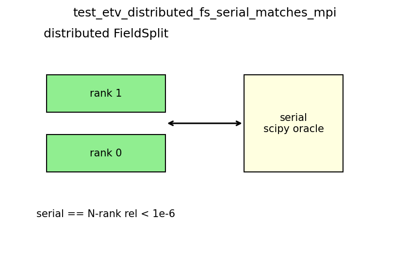

### `test_etv_distributed_fs_serial_matches_mpi`
- **Public API:** CLI `python -m eda_multiphysics.etv_distributed_fs 24 --validate`
- **Physics:** 2-D distributed coupled electro-thermal solve on PETSc/MPI.
- **Oracle:** serial `scipy` solution matches the 2-rank distributed solution.
- **Assertion:** `max rel err < 1e-6`.
- **Note:** because `petsc4py` initialises MPI in the parent pytest process, the test
  invokes `mpirun` as a subprocess with `env=os.environ.copy()` to avoid OpenMPI
  singleton variables set in the C environment.

---

## 13. Toolchain tier: reliability

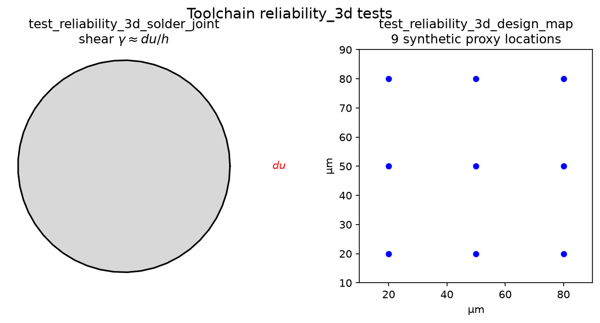

### `test_reliability_3d_solder_joint`
- **Public API:** `eda_multiphysics.reliability_3d.solve_solder_joint`
- **Physics:** gmsh-meshed solder joint, bottom fixed, top displaced by the DNP
  differential shift `du = Δα ΔT L_D`.
- **Oracle:** engineering shear strain `γ ≈ du/h`.
- **Assertion:** FE shear within 15% of DNP estimate; `N_f` finite and positive.

### `test_solder_bump_profile_geometry`
- **Public API:** `eda_multiphysics.mesh3d.solder_bump`
- **Geometry:** revolved barrel and hourglass profiles with pad and mid-height radii.
- **Assertions:** all mesh nodes belong to Hex8 volume elements; cap and lateral sets are nonempty;
  caps lie at the exact requested z coordinates; maximum radius and shape classification match the
  profile; OCC volume is finite; minimum signed Hex8 Jacobian is positive.
- **What failure means:** CAD construction, volume-node filtering, boundary tagging, or Hex8
  orientation regressed.

### `test_reliability_3d_profile_changes_strain_field`
- **Public API:** `eda_multiphysics.reliability_3d.solve_solder_joint`
- **Physics:** identical DNP shear applied to cylindrical and hourglass joints.
- **Assertion:** both cap boundary conditions are exact and the 95th-percentile equivalent strain
  differs by more than 2%, proving the selected geometry reaches the solved field.
- **What failure means:** the shape selector is inactive, the wrong mesh entered the operator, or
  geometry sensitivity was lost.

### `test_solder_package_conformal_regions`
- **Public API:** `eda_multiphysics.mesh3d.solder_package`
- **Geometry:** profiled solder, complementary underfill shell, top/bottom UBM, and pads.
- **Assertions:** six named regions; connected positively oriented Tet4 mesh; every named interface
  shares nodes; exact external pad elevations; solder + underfill equals the outer-cylinder OCC
  volume; pad and UBM volumes match `πR²t`.
- **What failure means:** boolean fragmentation, region classification, interface conformity, or
  Tet4 orientation regressed.

### `test_solder_package_multimaterial_solve`
- **Public API:** `eda_multiphysics.reliability_3d.solve_solder_package_joint`
- **Physics:** one thermo-mechanical `ElementGroup` per named material region under pad-to-pad DNP
  shear.
- **Assertions:** exact pad boundary conditions, finite nonzero solder strain, and fewer than 40
  FieldSplit KSP iterations.

### `test_reliability_design_map_with_package_regions`
- **Public API:** `eda_multiphysics.reliability_3d.from_design(include_package=True)`
- **Assertion:** the nine-point layout map reports the package model and produces finite nonconstant
  positive life predictions.

### `test_reliability_3d_design_map`
- **Public API:** `eda_multiphysics.reliability_3d.from_design`
- **Physics:** fatigue map from the versioned project-authored synthetic joint map,
  explicitly sourced as a proxy.
- **Regression assertions:** nine joints, extent 60×60 µm, critical DNP `sqrt(1800)` µm; life array
  monotonic and finite positive.
- **What failure means:** the layout parser or the life scaling broke.

### Joint-map schema regressions
- **Public API:** `eda_multiphysics.joint_map.load_joint_map` and
  `eda_multiphysics.reliability_3d.design_joints`.
- **Assertions:** coordinate/dimension unit normalization, affine package-to-die transform, stable
  unique IDs, explicit-map priority, labeled PDN fallback, and nine-row synthetic-proxy provenance.
- **What failure means:** geometry identity, coordinate meaning, or fallback honesty broke before
  the FE solve began.

---

## 14. TSV-to-device foundation — numerical/model verification, not experimental validation

### `tests/test_tsv_device.py`
- **Public API:** `eda_multiphysics.tsv_device` and `eda_multiphysics.tsv_validation`.
- **Exact gates:** Ryu's cubic-Si stiffness entries and 90° fourfold symmetry; zero stress under
  uniform thermal free expansion; proper-rotation rejection; published piezoresistance units and
  [100]/[110] equations; Jiang's `sigma_xx + sigma_yy = -470 delta_omega` observable.
- **Integration gates:** stable source-object/device/TSV identity, coordinate preservation,
  user-selected KOZ threshold, deterministic device-scale-dimension synthetic preview and SVG map, and
  release-evidence claim boundary.
- **Provenance gates:** four benchmark manifests carry units, source locators, calibration roles,
  uncertainty fields, and verified canonical SHA-256 hashes. The ten-category release scorecard
  evaluates to `alpha_numerical_prototype` while experimental and multilevel evidence is missing.
- **What passing proves:** the crystal/device-proxy equations, unit conversions, IDs, manifests,
  and fail-closed status machinery are correct.
- **What it does not prove:** near-surface anisotropic TSV stress, the specimen-C/D Raman curves,
  transistor mobility/delay, conservative global-local transfer, or signoff KOZ.

The executable preview is `python examples/tsv_00_device_screening/run.py`. It uses a 10 µm TSV,
−250 °C cooling, 32 explicit device sites, and published coefficients, but its upstream stress is
the classical Lamé far-field proxy. Its scorecard therefore contains `release_validation=false`.

---

## 15. Anisotropic local-TSV foundation — numerical mechanics, not Raman validation

### `tests/test_tsv_local_3d.py` and `test_tsv_device_submodel_geometry_regions_and_interfaces`

- **Public API:** `mesh3d.tsv_device_submodel`, `mesh3d.tsv_periodic_cell`, and
  `eda_multiphysics.tsv_local_3d`.
- **Constitutive gates:** published cubic-Si `C11/C12/C44` entries survive engineering-Voigt
  conversion; a 90° (001) rotation retains fourfold symmetry; the Tet4 constant-strain matrix
  reproduces an arbitrary affine displacement field; fully constrained thermal stress matches
  `-D alpha deltaT`.
- **Geometry gates:** Cu, scaled oxide cup, and Si are nonempty conformal Tet4 regions; side and
  bottom interfaces share nodes; direct Cu/Si contact is empty; every Tet4 has positive signed
  volume; all FE nodes are used; OCC-versus-mesh volume error is below 3%; top, bottom, and outer
  boundaries are nonempty; the local distance field records its near/far sizes, extent, and two
  Cu/liner source surfaces.
- **Periodic-geometry gates:** the scaled full cell has equal-count, exactly translated
  `x-/x+` and `y-/y+` faces, a proper `[110]/[-110]/[001]` frame, exact pitch bounds, an oxide cup,
  zero direct Cu/Si contact, no orphan nodes, and region-volume errors below 3%. Gmsh and CoupFE
  independently report the full matching-node correspondence with zero mismatch.
- **Periodic-mechanics gates:** homogeneous cubic Si under `H=alpha*dT*I` reproduces affine free
  expansion with displacement error below `1e-18 m`, stress below `1e-8 MPa`, reduced residual below
  `1e-10`, and zero MPC error. The zero-jump broken control develops about 29.1 MPa. The heterogeneous
  Cu/oxide/anisotropic-Si solve has reduced residual `1.72e-14` and zero MPC error. These qualify
  serial assembly and constraint mechanics, not the Jiang boundary choice or Raman curve.
- **Integrated numerical gate:** the scaled blind-TSV solve has a free-equilibrium residual below
  `1e-10`; full element stresses are finite; [110] sampling occurs at the exact requested depth and
  returns `sigma_xx + sigma_yy` from silicon elements. The regression explicitly uses the
  `silicon_free_expansion` outer/bottom condition; the result records that boundary label,
  coordinate/crystal frame, and material/mesh SHA-256 identities.
- **Fail-closed gates:** negative interface distance and sampling outside the Tet4 field are rejected.
- **Recovery/sensitivity gates:** a uniform field survives both volume averaging and consistent P1
  L2 projection; Gaussian spot weights sum to one, preserve the scan center/depth, and require an
  explicit positive width.
- **What passing proves:** the corrected three-region oxide-cup geometry, anisotropic constitutive
  conversion, linear assembly, stress recovery, exact-depth extraction, matching periodic geometry,
  and serial exact-MPC interfaces execute together.
- **What it does not prove:** source-equivalent macro/bottom boundary semantics, corrected-scene
  mesh/domain convergence, distributed MPC, Hex8 agreement, specimens C/D Raman curves, measured transistor
  mobility, array interaction, or signoff KOZ. Results therefore retain
  `release_validation=false` and the release scorecard is unchanged.

The separate sensitivity evidence is intentionally failing: last-two-mesh differences were
6.9–14.3% depending on an assumed spot width, and radial domain enlargement was 14% at the largest
tested scaled pair. Those values belong to the superseded sidewall-only topology. They diagnose the
need for a periodic cell but are neither corrected-scene regression tolerances nor accepted
validation results.

The physical defaults are 10 µm Cu diameter, 55 µm blind-via depth, 0.4 µm SiO2 liner, and a
0.2 µm Raman depth. The regression uses a geometrically scaled case so it remains a quick toolchain
gate; dimensional defaults and held experimental loads live in the benchmark manifests.

**Historical execution record, 12–13 July 2026:** the then-current trees recorded 82/82 fast and
19/19 toolchain passes (101 tests total), followed by a periodic-MPC consumer rerun and core checks
at 1/2/4 ranks. Raw console logs and a locked environment were not retained, so those counts remain
historical. The 31 July candidate instead pins public Core `933e497` and passes the standalone
53-gate harness, current 94-test default tier, and separate 19-test toolchain tier; the standalone
gates overlap wrappers in the default tier. Publication evidence must come from the clean
committed-root recorder described in `RELEASE_EVIDENCE.md`, including the runtime Core identity
and installed-wheel checks.

Even a fresh pass would confirm executable gates, not experimental TSV validation.
Source-equivalent macro/bottom boundary semantics, corrected-scene convergence, memory-local
production MPC, and a distributed TSV consumer remain open.

---

## 16. Reading a failure

When a gate fails, look at:

1. **Which tier?** Fast gates isolate pure Python/operator bugs; toolchain failures
   usually involve gmsh, PETSc, or Fortran compilation.
2. **Oracle type.** Analytic oracle failures point to the operator. Literature-benchmark
   failures may be parameter or geometry mismatches. Broken-control failures point to
   sign / source-term bugs.
3. **Tolerance.** Tight tolerances (`<1e-12`) are exact/nodal; looser tolerances
   (`6e-3`, `15%`) are discretization- or calibration-sensitive.

---

## 17. References

- **Choi et al.** — "Thermal Stress Analysis of Through-Silicon Via," *Materials* 2021,
  14(18):5226, PMC8472814.
- **Motalab, Cai, Suhling, Lall** — "A Study of Anand Constitutive Model Constants for
  SAC305 Solder," ITherm 2012 / Auburn PhD dissertation 2013.
- **Cheng, Wang, Chen, Wilde, Becker** — "Viscoplastic Constitutive Relation of Solder
  Alloys," *Soldering & Surface Mount Technology* 12(2) 2000.
- **Timoshenko** — "Analysis of Bi-Metal Thermostats," 1925.
- **Timoshenko & Goodier** — *Theory of Elasticity*, Art. 152.
- **Dandu et al.** — "Current Crowding in Interconnects," *Microelectron. Reliab.*
  50(4):547, 2010.
- **Black** — "Electromigration — A Brief Survey and Some Recent Results," *IEEE Trans.
  Electron Devices* 1969.
- **Blech** — "Electromigration in Thin Aluminum Films on Titanium Nitride," *J. Appl.
  Phys.* 1976.
- **Bhat et al.** — "Thermal Runaway in Semiconductor Devices," ACM TECS 2017.
- **Syed** — "Accumulated Creep Strain and Energy Density Based Thermal Fatigue Life
  Prediction Models for SnAgCu Solder Joints," ECTC 2004.
- **Darveaux** — "Effect of Simulation Methodology on Solder Joint Crack Growth Model and
  Thermal Fatigue Life Prediction," *Advancing Microelectronics* 2000.
- **Ryu et al.** — "Effect of Thermal Stresses on Carrier Mobility and Keep-Out Zone Around
  Through-Silicon Vias for 3-D Integration," IEEE TDMR 2012, doi:10.1109/TDMR.2012.2194784.
- **Jiang et al.** — "Measurement and analysis of thermal stresses in 3D integrated structures
  containing through-silicon-vias," *Microelectronics Reliability* 2013,
  doi:10.1016/j.microrel.2012.05.008.
- **JEDEC JESD22-A104** / **JEDEC JEP119** / **IPC-9701**.
