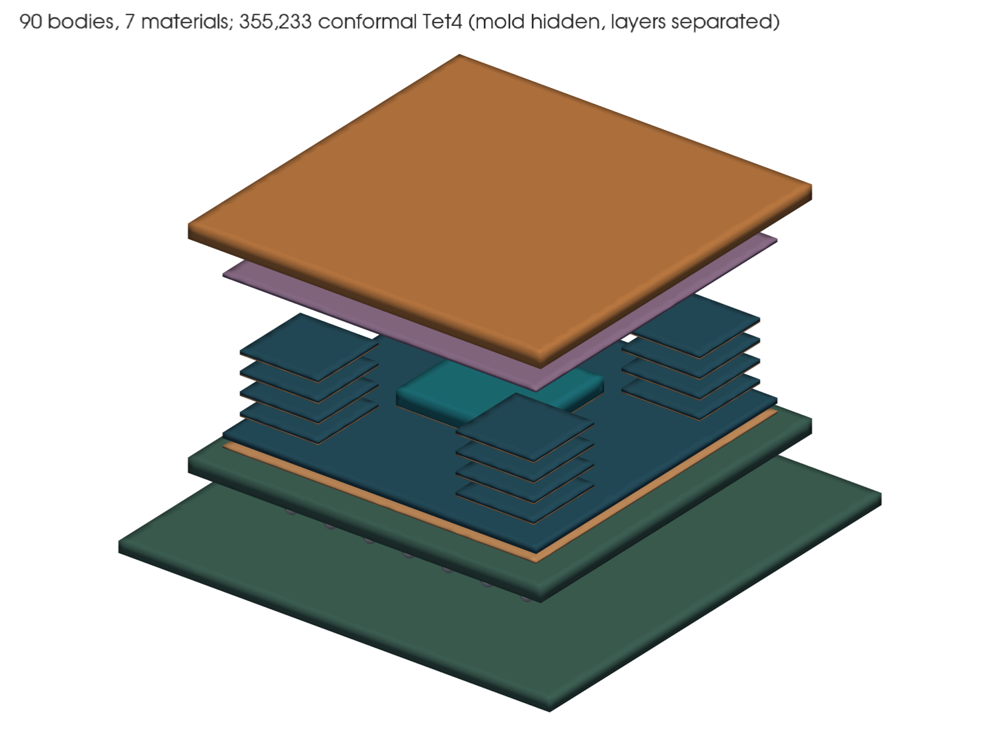
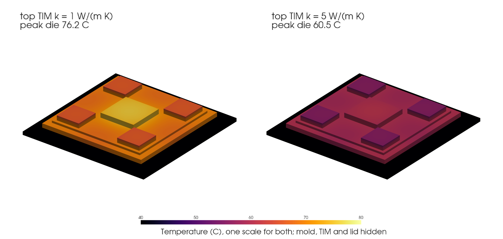
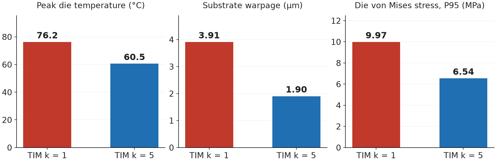

# Stacked-memory package: from heat to warpage

A synthetic, project-authored package with a logic die and four four-high memory
stacks is built as CAD, meshed conformally, heated by its dies, and then allowed
to deform. Two designs differ only in the top thermal-interface material (TIM):
1 versus 5 W/(m K). The better TIM lowers the peak die temperature by about
16 °C and roughly halves the substrate warpage. An independently written FEniCSx
solve of the same declared model agrees with the CoupFE result to about 1e-9 on
every field.








## Run it

```bash
# repository environment and pinned CoupFE as in the top-level Quick start
python examples/stacked_memory_package/run.py --check                    # 0.65 mm mesh, about 2 min
python examples/stacked_memory_package/run.py --mesh-size 0.45 --check   # headline mesh, about 9 min
```

- **Compiled kernels:** the thermal kernel (CoupFE-EDA's generated native
  electrothermal Tet4, with the potential held at zero) and the thermoelastic
  kernel (generated by CoupFE from CoupFE-EDA's thermomechanical weak form)
  compile on first use with `gfortran`, into `_kernels/` (untracked).
- **Meshing needs `gmsh`.** If the solver Python does not have it, pass
  `--cad-python /path/to/python-with-gmsh` or set `CAD_PYTHON`.
- **Outputs:** each run writes `runs/h<size>/`. It holds the STEP file, the
  mesh, field arrays for both designs, `result.json` (thermal),
  `mechanics_result.json`, a quality audit and `summary.json`.
- **Figures:** `render_figures.py` (needs `pyvista`) redraws the figures above
  from a finished run, plus `figures/hero.png`, the project website's lead
  figure (`--only hero` draws just that one).
- **Check:** `--check` compares the run with the retained result for that mesh
  size. The first item it compares is the Gmsh version, because the mesh (and
  with it every number) is reproducible only with the same Gmsh version and one
  meshing thread.

## Retained result

| Mesh | Nodes / Tet4 | Top TIM k [W/(m K)] | Peak die [°C] | Substrate warpage [µm] | Die von Mises P95 [MPa] |
|---|---|---:|---:|---:|---:|
| 0.45 mm (headline) | 88,154 / 355,233 | 1 | 76.21 | 3.906 | 9.975 |
| | | 5 | 60.54 | 1.901 | 6.536 |
| 0.65 mm (quick check) | 40,253 / 155,422 | 1 | 75.69 | 3.465 | 9.667 |
| | | 5 | 60.40 | 1.663 | 6.499 |

On the 0.45 mm mesh the better TIM lowers the peak die temperature by 15.7 °C,
and the improved-to-baseline warpage ratio is 0.487 (0.480 on the 0.65 mm
mesh).

Timings on the 0.45 mm mesh: build 43 s, thermal 41 s, mechanics 464 s. Almost
all of the mechanics time is one sparse LU factorization of 264,456 unknowns,
shared by both designs. Retained values are in
[`expected_results_h045.json`](expected_results_h045.json) and
[`expected_results.json`](expected_results.json); Gmsh 4.15.2 and CoupFE
`e2f42ed`.

## The model

**Geometry** (`build_package.py`, built in mm and solved in m): 90 bodies and 7
materials, meshed conformally with shared nodes at all 176 body interfaces.

| Layer | Bodies | Material |
|---|---|---|
| board | 22 × 22 × 0.56 mm | organic |
| ball grid | 7 × 7 truncated spheres | solder |
| substrate | 18 × 18 × 0.7 mm | organic |
| interposer | silicon, on an attach layer | silicon, attach |
| logic die | 6 × 6 × 0.75 mm, on an attach layer | silicon (8 W) |
| memory stacks | four stacks of four 4 × 4 × 0.15 mm dies, each on an attach layer | silicon (0.5 W per die) |
| encapsulation, top TIM, lid | mold around the dies, then the TIM, then an 18 × 18 × 0.7 mm lid | mold, top_tim, copper |

**Thermal** (`solve_thermal.py`): steady isotropic Fourier conduction with
16 W in total (uniform volumetric power per die).

| | Value |
|---|---|
| lid top | Robin cooling, h = 4000 W/(m² K) to 40 °C |
| board bottom | held at 40 °C |
| other faces | adiabatic |

Conductivity [W/(m K)]:

| organic | attach | silicon | mold | copper | solder | top TIM |
|---:|---:|---:|---:|---:|---:|---:|
| 0.8 | 1.5 | 120 | 0.8 | 390 | 50 | 1 or 5 |

**Mechanics** (`solve_mechanics.py`): one-way, small-strain isotropic linear
thermoelasticity on the same nodes, stress-free at 40 °C.

| | Value |
|---|---|
| supports | minimal 3-2-1 anchors at three board corners |
| other faces | traction-free |
| coupling | deformation does not feed back into temperature |

Material data, as E [GPa] / ν / CTE [1/K]:

| organic | silicon | attach | mold | copper | solder | top TIM |
|---|---|---|---|---|---|---|
| 20 / 0.30 / 16e-6 | 130 / 0.28 / 2.6e-6 | 1 / 0.35 / 40e-6 | 18 / 0.30 / 12e-6 | 110 / 0.34 / 17e-6 | 40 / 0.35 / 22e-6 | 0.05 / 0.35 / 60e-6 |

**Reported quantities:**
- **Warpage** is the peak-to-valley out-of-plane displacement of the substrate
  top face after least-squares plane removal.
- **Die stress** is the volume-weighted 95th percentile of element von Mises
  stress over the powered dies.

## Checks

Each run checks itself and fails if any check does not pass:

- **Thermal kernel:** an exact Fourier-flux patch on a six-tet cube.
- **Zero-power control:** no temperature rise.
- **Heat balance:** below 1e-8 (observed about 1e-13).
- **Free residuals:** about 1e-12 (thermal) and 1e-13 (mechanics).
- **Free thermal expansion:** exact (about 3e-15).
- **Constrained-stress CTE convention.**
- **Mesh:** non-manifold, connectivity and positive-volume checks, plus a
  quality audit (minimum tetrahedron gamma 0.21 on the 0.45 mm mesh).

**Independent implementation.** [`fenicsx_verification/`](fenicsx_verification/)
solves the same declared model with DOLFINx 0.10 on the same mesh. It does not
import CoupFE or reuse any matrix or result. On the 0.45 mm mesh:

| | Largest relative difference |
|---|---:|
| every full field | 4.8e-10 |
| every reported metric | 3.4e-10 |

The tolerances, fixed beforehand, were 1e-5 and 1e-4. See
[`COMPARISON.md`](fenicsx_verification/COMPARISON.md). This checks the numerical
implementation of the model, not the model.

**Mesh sensitivity** between the 0.65 and 0.45 mm meshes:

| | Change |
|---|---|
| peak die temperature | 0.52 °C or less |
| die stress P95 | 3.1% or less |
| warpage | 11–13% |
| warpage ratio between the two designs | 0.480 vs 0.487 |

The two meshes differ in element size and quality, so this is a sensitivity
comparison, not a convergence study.

## Reproducibility

The builder meshes with one thread by default. Two builds with the same Gmsh
version give the same mesh, bit for bit; a four-thread build of the 0.65 mm
case gave 40,346 nodes instead of 40,253. Solver results on a given mesh repeat
to the tolerances in the retained files.

## What this is not

- **Inputs are illustrative:** the geometry, stackup, powers and material values
  are synthetic. They are not a product and have not been physically qualified.
- **Physics is idealized:** steady, linear and one-way. There is no
  temperature-dependent property, contact resistance beyond the explicit layers,
  TSV or microbump detail, cure stress, plasticity, creep, delamination, fatigue
  or life prediction. Solder is linear elastic.
- **No experimental or device validation.** Warpage is mesh-sensitive at the
  10–13% level, so use the relative effect of the TIM, which both meshes agree
  on, rather than absolute micrometres.
