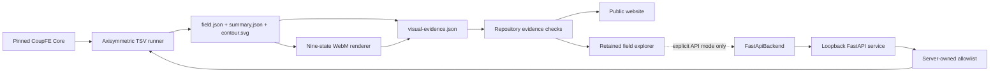

# CoupFE-EDA web architecture

## Three explicit surfaces

Presentation, retained-field inspection, and local execution remain separate:

| Surface | Data/execution source | Purpose |
|---|---|---|
| Public website | Checked repository records and retained media | Explain current evidence, examples, benchmarks, and boundaries |
| GitHub Pages field explorer | Strictly validated retained `field.json` | Probe the real stored mesh/fields and visit nine solved load states |
| Local connected field explorer | Retained field initially; one loopback FastAPI workflow on Run | Execute and inspect the fixed CoupFE field case |

The default `SiteApp` route is the repository-backed website.
`?surface=workbench` is an explicit field-explorer route, not a separate
illustrative product prototype. In the public build it receives no backend and
therefore has no Run action. In API mode it receives `FastApiBackend` and can
request one fixed workflow.

There is no `MockBackend`, mock numerical seed, simulated queue, or fabricated
solver completion in the retained build.



The load-sweep video and explorer playback traverse nine independent static
CoupFE solves at prescribed `ΔT` values. They do not interpolate between solved
load states or represent transient time integration.

## Solver evidence flow

The featured field has a traceable, one-way path:

```text
eda_multiphysics.tsv_stress.solve_tsv_field
              ↓
examples/tsv_axisymmetric_field/run.py
              ↓
field.json + summary.json + contour.svg
              ↓
render_video.py → load-sweep.webm
              ↓
visual-evidence.json (four artifact hashes + provenance/semantics)
              ↓
scripts/check-repository-data.mjs
              ↓
scripts/prepare-repository-assets.mjs
              ↓
public website + retained field explorer
```

`field.json` is the canonical browser data source. It contains the 2,400-node,
2,399-element radial Line2 mesh, connectivity and region labels, the final
nodal displacement and element-center `sigma_rr`/`sigma_theta`, and full arrays
plus solver/comparison records for every load state. `summary.json` carries the
fixed inputs, numerical result, FE/Lamé comparison, solver telemetry, exact
EDA/Core revisions, module/operator/solver identity, and normalized command.

The public manifest binds exactly four artifact roles: raw field, summary,
image, and video. It also binds the case and claim boundary, two 40-hex source
revisions, argv-style command, topology/mesh/DOF/components/load semantics,
and renderer configuration. The manifest is validated against an exact
non-symlink file inventory and every declared byte count and SHA-256 digest.
The manifest itself is outside that four-artifact inventory.

The public claim is intentionally narrower than the visualization:

> Axisymmetric plane-strain thermoelastic component verification against the
> declared Lamé equation. It is not a finite-depth 3-D TSV, near-surface device
> field, experimental validation, keep-out-zone signoff, or transient cooling
> simulation.

The circular contour is an axisymmetric reconstruction of a one-dimensional
radial solution, not evidence that a 3-D mesh was solved.

## Browser field trust boundary

The retained explorer fetches `field.json` directly; it does not use a backend
adapter. Before display, `validateTsvFieldBundle` checks the reviewed case and
claim, Line2 topology, mesh dimensions and monotonic radii, connectivity/region
lengths, copper/silicon labels, finite array sizes, geometry, convergence,
passed comparisons, nine ordered static solve records, and final-state
consistency. Invalid data produces a visible rejection state rather than a
partial contour.

After validation, all contour colors, radial curves, probe values, field
metrics, and load-state views are derived from the arrays. The mesh overlay is
a visual aid on the axisymmetric reconstruction; it is not a replacement mesh
or a claim about 3-D topology. A fixed stress scale across the load states
supports comparison without rescaling each frame.

The public site itself uses `site-data.json` for reviewed display labels and
headline values. That file is not an independent numerical authority; the
repository checker compares it with runners, oracles, retained records,
manifests, examples, benchmarks, roadmaps, and licensing sources.

The retained scaling visualization remains a separate horizontal comparison
of four measured median solve times. It uses a zero baseline, direct
rank/time/speedup labels, the stated 526,338-DOF fixed problem, three repeats
per rank, and the recorded machine boundary. It does not extrapolate beyond
the retained 1/2/4/8-rank measurements.

## Connected frontend contract

Only API mode constructs a `CoupFEBackend`:

```ts
getSnapshot(projectId, signal?)
startRun(request, signal?)
cancelRun(projectId, runId, signal?)
subscribeProjectEvents(projectId, afterSequence, observer)
```

`ProjectSnapshot` is the authoritative connected read model. It can represent
designs, approved workflows, runs, evidence, artifacts, and optional future
model-selection records. The current snapshot contains one fixed design and
one approved workflow. Its `models`, `decisions`, `layers`, and `candidates`
arrays remain empty; the UI does not fabricate absent records.

The retained explorer does not manufacture a `ProjectSnapshot`. It loads the
reviewed field bundle directly and shows a static-mode boundary stating that
GitHub Pages cannot run CoupFE.

## Approved execution boundary

The connected browser request names the project, active design, and workflow,
but cannot define execution:

```json
{
  "projectId": "coupfe-eda-local",
  "designId": "tsv-axisymmetric-field-v1",
  "workflowId": "tsv_axisymmetric_field",
  "clientRequestId": "browser-generated-uuid"
}
```

The service maps that workflow to `tsv.axisymmetric-field.v1`. The registry
owns the Python executable, driver, required `--output-dir`, 180-second timeout,
server run root, oracle, and artifact allowlist. Pydantic forbids extra request
fields, including a supplied executor key, command, parameters, or output
path.

The runner uses the real `AxisymThermoelastic` operator and
`coupfe.newton_solve`. The service revalidates strict finite outputs, fixed
inputs and shapes, all nine actual solves, residual acceptance, final-field
consistency, exact claim and provenance, the 3% comparison boundary, and the
retained oracle before a run can succeed.

Each accepted request receives a stable run ID. `clientRequestId` makes retries
idempotent. Run/event mutations increase a project sequence; server-sent
events invalidate the browser snapshot, which is then reloaded.

Successful connected runs expose hashes for `field.json`, `summary.json`,
`contour.svg`, `stdout.txt`, and `stderr.txt`, plus a service-created
`manifest.json`. That manifest records the driver/oracle, local elapsed time,
EDA source revision and clean/dirty state, numerical result, and hashes. It is
not the public four-role visual-evidence manifest and does not include a video.

## Deployment and persistence boundary

| Surface | Backend | Execution | Persistence | Intended use |
|---|---|---|---|---|
| GitHub Pages website | none | none | checked static files | Present current evidence and boundaries |
| GitHub Pages field explorer | none | none | checked static `field.json`/media | Inspect retained real solver output |
| Local connected explorer | loopback `FastApiBackend` | one approved fixed CoupFE workflow | server-owned run directories plus process-memory index | Recompute and inspect the reference field |

GitHub Pages always builds with `VITE_COUPFE_BACKEND=retained`. It does not
probe localhost or silently switch to an execution backend. API mode is an
explicit Vite/build mode.

The FastAPI service is unauthenticated and refuses non-loopback binding. Remote
access would need a separate authentication, authorization, isolation,
resource-control, and audit design; this service is not a network-service
template.

The service run index is process memory. Successful output directories persist
beneath the server-owned run root, but restart does not reconstruct the index.
Only successful artifacts are downloadable. A dirty checkout is recorded, but
neither the local manifest nor the runner's HEAD revision retains the dirty
diff.

## Current validation limits

- The TSV field establishes an axisymmetric plane-strain numerical comparison
  with the declared Lamé equation. It does not establish near-surface or
  finite-depth 3-D stress, experimental/device accuracy, transistor response,
  keep-out-zone signoff, or transient cooling response.
- The nine prescribed loads are independent static solutions. Their visual
  ordering is not a physical time axis.
- The fixed-size MPI result is one retained machine/rank sweep, not a general
  scaling law.
- Project-authored validation-guide figures summarize named checks;
  presentation quality does not increase their evidentiary authority.
- `FastApiBackend` trusts generic JSON from the same-repository loopback
  service after HTTP status checks. Dedicated runtime validation exists for
  `field.json`, but a general API response-schema validator remains open.
- The explorer is not a CAD editor, mesher, general job scheduler, signoff
  system, or multi-user project service.

## Test obligations

Frontend checks cover retained-field schema rejection, array-derived contour
and probes, actual load-state selection, retained/connected mode separation,
connected action/event behavior, route separation, repository-data contracts,
and base-path production builds. Python tests cover structured field recovery,
real `newton_solve` use, hoop stress, backward compatibility, the full 2,400
node oracle, nine independent solves, the allowlisted executor, output/source
validation, idempotent store, confinement, API rejection, and a complete local
run. Visual-evidence tests cover strict manifest metadata, safe paths, exact
inventory roles, hashes, and non-finite/duplicate JSON rejection.

Any new public workflow must add bounded real repository evidence first, then
extend the manifest/checker, site data, UI, API registry, and tests. It must not
enter through illustrative browser data.
