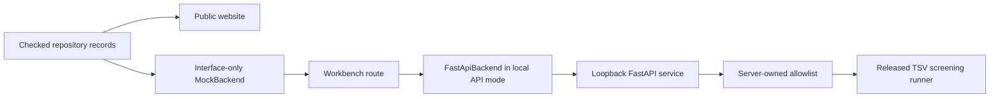

# CoupFE-EDA web architecture

## Three explicit surfaces

The frontend keeps presentation, interface exploration, and local execution separate:



The default `SiteApp` route is the repository-backed website. `?surface=workbench` is an explicit route, not the landing page.

In the public build, `MockBackend` only simulates queue, progress, and completion events. It displays the already retained TSV SVG/CSV/JSON and imports their reviewed hashes from `contracts/retained-tsv-artifacts.json`. It does not execute a solver, create an engineering run, or invent a solver manifest. Its progress text describes loading the synthetic site record, evaluating the precomputed analytic screening record, and linking reviewed evidence.

In API mode, the same workbench route uses `FastApiBackend`. The local service executes a server-registered workflow and retains a real local run directory, manifest, source identity, stdout/stderr, and result artifacts.

## Evidence flow

Public values have one-way provenance:

```text
example / benchmark / scorecard source
              ↓
scripts/check-repository-data.mjs
              ↓
site-data.json + retained artifact metadata
              ↓
public website
```

The build fails when a linked source is absent or when a checked numerical record, scorecard status/reason, TSV claim boundary, or public TSV checksum differs from its source. `prepare-repository-assets.mjs` copies project-authored figures and the applicable legal records into the site artifact after the check.

The scaling visualization is a horizontal comparison of the four retained median solve times. It uses a zero baseline, direct rank/time/speedup labels, the stated 526,338-DOF fixed problem, three repeats per rank, and the machine/claim boundary beside the chart. It does not extrapolate beyond the measured 1/2/4/8-rank record.

## Shared frontend contract

React depends on `CoupFEBackend`:

```ts
getSnapshot(projectId, signal?)
startRun(request, signal?)
cancelRun(projectId, runId, signal?)
subscribeProjectEvents(projectId, afterSequence, observer)
```

`ProjectSnapshot` remains the authoritative workbench read model. It can represent designs, approved workflows, runs, evidence, artifacts, and optional model-selection records. The public and connected snapshots intentionally contain no model definitions, candidate designs, thermal/warpage/margin records, or model decisions; those arrays are empty and the corresponding navigation is hidden. Retaining the broader types preserves the prototype's future interface direction without presenting unreviewed records as current capability.

Missing records stay missing. Selectors return empty, `undefined`, review, or `not-evaluable` states instead of fabricating a pass or a display value.

## Approved execution boundary

The browser request names a workflow but cannot define execution:

```json
{
  "projectId": "coupfe-eda-local",
  "designId": "tsv-synthetic-device-sites-v1",
  "workflowId": "tsv_device_screening",
  "clientRequestId": "browser-generated-uuid"
}
```

The service maps that workflow to `tsv.device-screening.v1`. The server owns the Python entry point, arguments, timeout, output root, and artifact allowlist. Pydantic rejects extra browser fields, including a supplied executor key or command.

Each accepted request receives a stable run ID. `clientRequestId` makes retries idempotent. Run and event mutations increase a project sequence; server-sent events invalidate the browser snapshot, and the browser reloads the authoritative state.

Completed connected runs retain real SHA-256 values. Completed mock events retain only references to the reviewed repository artifacts and are labeled as interface simulation.

## Deployment boundary

| Surface | Backend | Execution | Persistence | Intended use |
|---|---|---|---|---|
| GitHub Pages website | none until the workbench route is opened | none | static files | Explain current code, examples, benchmarks, and boundaries |
| GitHub Pages workbench route | `MockBackend` | simulated lifecycle only | browser memory | Inspect the proposed interaction contract |
| Local connected workbench | loopback FastAPI | one approved repository workflow | server-owned local run directories | Run and inspect the released TSV demonstration |

GitHub Pages always builds with `VITE_COUPFE_BACKEND=mock`. It does not probe localhost or silently switch to an execution backend. API mode is an explicit separate build or Vite mode.

The FastAPI service is unauthenticated and refuses non-loopback binding. Adding remote access would require a separate authentication, authorization, isolation, resource-control, and audit design; the current service is not a network-service template.

The first service keeps its API run index in process memory. Successful output
directories persist beneath the server-owned run root, but restarting the
service does not reconstruct that index. Only successful artifacts are exposed
through the API. A dirty checkout is recorded as `dirty`; the current manifest
does not retain the dirty diff or claim exact dirty-input reconstruction.

## Current validation limits

- The public TSV screening record is a deterministic synthetic integration example, not experimental TSV/device validation.
- The fixed-size MPI result is one retained machine/rank sweep, not a general scaling law.
- Project-authored validation-guide figures summarize named checks; presentation quality does not increase their evidentiary authority.
- `FastApiBackend` currently trusts JSON from the same-repository loopback service after HTTP status checks. A runtime response-schema validator is still required before connecting it to an independently deployed or untrusted service.
- The interface is not a CAD editor, mesher, field viewer, scheduler, signoff system, or multi-user project service.

## Test obligations

Frontend checks cover the repository-data contract, minimal public snapshot, interface-only mock lifecycle, idempotency, cancellation, event ordering, claim-boundary display, route separation, and base-path production build. Python tests cover the allowlisted executor, source and artifact provenance, idempotent store, path confinement, API request rejection, and a complete local run.

Any new public workflow should add real repository evidence first, then extend `site-data.json`, the checker, the website, and tests. It must not enter through an illustrative browser seed.
